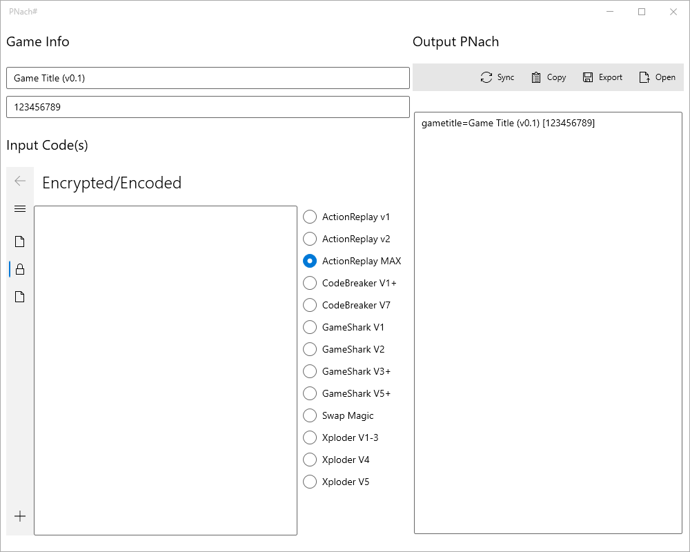
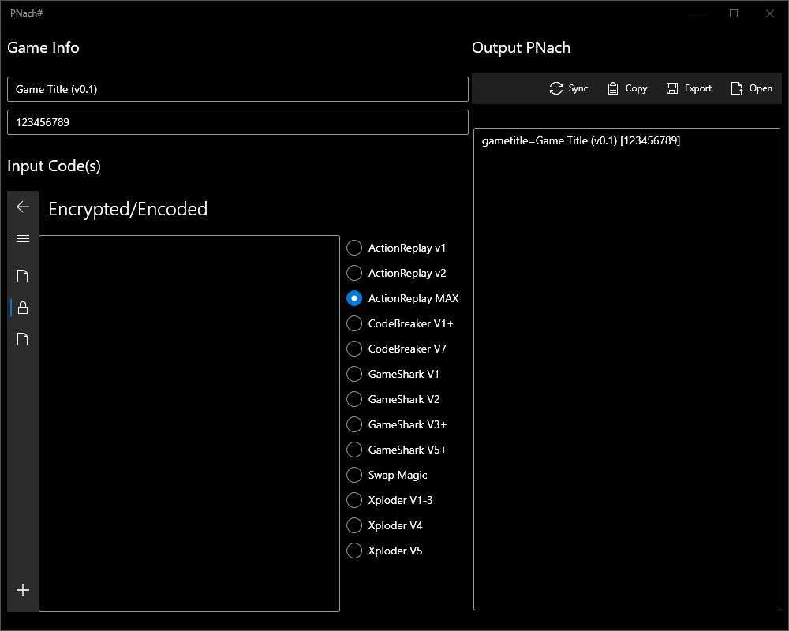

# PNachSharp
_C# + WPF PNach program_

### Description

This is a Windows program to create and edit PNach files, written with .NET 5.  
Consider it a more native-looking alternative to PNach-rs if you run WindoZzze.  
  
You can use this program to create PCSX2-compatible cheat files from random codes you may find on the internet.  

### Another PNach utility?
Sort of. This is essentially just a C# + WPF wrapper around my Rust libraries.  
It does everything PNach-rs does, only in a Windows-native way.

### Screenshots

This app uses the [Modern WPF UI Library](https://github.com/Kinnara/ModernWpf) to enable a WinRT/UWP "Fluent" design that matches Windows 10 and synchronizes with the selected OS app and accent colors:  

